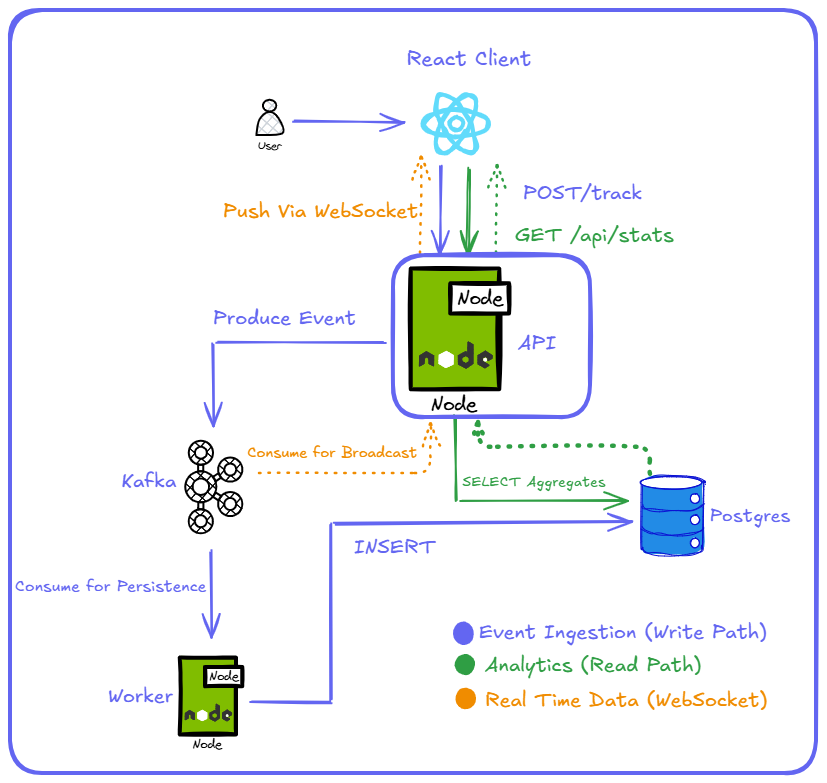

Here’s how all the parts connect:

# What it Does:
⦁	When you use the app, your actions are turned into events.
⦁	These events are sent through a Kafka message queue.
⦁	A worker picks them up, saves them to a PostgreSQL database, and sends updates back.
⦁	Everyone connected sees the live data update right away through WebSockets.

# Basic Workflow:
Here’s the basic flow:
1. React Client
⦁	Includes buttons and a search box to simulate user activity and every click or search sends an event to the Node.js API.

2. Node.js API
⦁	Publishes the event to Kafka right away.
⦁	Sends a quick response back to keep the app fast.

3. Kafka
⦁	Acts as the middle layer, it holds the events so they can be processed.

4. Worker Service
⦁	Listens to Kafka.
⦁	Saves data to Postgres for analytics.

5. WebSockets
⦁	The API pushes real-time updates back to all connected clients.
⦁	So, everyone sees live analytics with almost no delay.

# Tech Stack:
• Frontend: React, Tailwind CSS
• Backend: Node.js, WebSockets
• Messaging: Kafka
• Database: PostgreSQL
• Containerization: Docker
• Cloud: AWS ECR, AWS ECS

# Getting Started
1. Clone the repo
   git clone https://github.com/yourusername/your-repo-name.git
   cd your-repo-name

2. Install the packages
   cd into api directory end enter npm install
   Repeat the same for react-dashboard directory

3. To start the service
   docker-compose up

4. To view the app
   Go to https://localhost:5173
